# LLM Decode 阶段逐 Token 能耗分析报告

> **实验平台**: 8 × NVIDIA Tesla V100-SXM2-32GB (HBM2, 900 GB/s)
>
> **实验时间**: 2026 年 3 月 11-12 日
>
> **能耗测量**: Zeus (NVML `nvmlDeviceGetTotalEnergyConsumption`)，精度 ±1 mJ

---

## 目录

- [1. 研究动机](#1-研究动机)
- [2. 实验设计](#2-实验设计)
- [3. 实验结果](#3-实验结果)
  - [3.1 实验 A: 流式服务场景 (Qwen3-8B)](#31-实验-a-流式服务场景-qwen3-8b)
  - [3.2 实验 B: 并发批量场景 (Qwen3-32B)](#32-实验-b-并发批量场景-qwen3-32b)
  - [3.3 实验 C: Batch Size Sweep (Qwen3-8B, max_num_seqs=40/60/100)](#33-实验-c-batch-size-sweep-qwen3-8b-max_num_seqs4060100)
  - [3.4 跨模型对比分析](#34-跨模型对比分析)
  - [3.5 跨 Batch Size 对比分析](#35-跨-batch-size-对比分析)
- [4. 理论分析与验证](#4-理论分析与验证)
- [5. 核心结论](#5-核心结论)
- [6. 对未来工作的指导意义](#6-对未来工作的指导意义)

---

## 1. 研究动机

### 1.1 为什么要测量逐 Token 的 GPU 能耗？

大型语言模型 (LLM) 的推理过程分为两个阶段：

- **Prefill 阶段**：处理输入 prompt 的所有 token，计算初始 KV cache。这是一个 **compute-bound** 的操作。
- **Decode 阶段**：逐 token 自回归生成。每生成一个新 token，需要读取全部模型权重和已有的 KV cache。这是一个 **memory-bandwidth-bound** 的操作。

在 decode 阶段，随着已生成 token 数量的增长，KV cache 持续膨胀。**理论上**，每个新 token 需要从 HBM 读取的数据量会线性增加（因为 attention 需要遍历所有历史 KV），从而导致能耗也线性增长。

**但这一理论预测此前缺乏实测验证。** 具体而言：

1. KV cache 增长带来的能耗增量相对于模型权重读取有多大？
2. 在真实的 vLLM 推理引擎中，这一效应是否可观测？
3. 不同模型规模 (8B vs 32B) 的能耗增长模式是否一致？
4. 在线服务场景（请求陆续到达）和离线批处理场景（请求同时开始）的能耗特征有何差异？
5. **不同 batch size（并发度）对 per-token 能耗有什么影响？是否存在最优 batch size？**

### 1.2 为什么选择这三组实验配置？

| 维度 | 实验 A (Stream) | 实验 B (Batch) | 实验 C (Batch Size Sweep) |
|------|-----------------|----------------|--------------------------|
| **模型** | Qwen3-8B | Qwen3-32B | Qwen3-8B |
| **场景** | 模拟在线服务 | 离线批处理 | **不同 batch size 对比** |
| **请求到达方式** | 20 req/min 持续注入 | 30 个请求同时提交 | 30 req/min，分别限制 max_num_seqs |
| **最大生成长度** | 12,000 tokens | 15,000 tokens | 12,000 tokens |
| **实验时长** | 12,000s (3.3 小时) | ~1,200s × 3 轮 | 1,800s × 3 轮 (每轮不同 batch size) |
| **Batch Size 控制** | 不限制 | 固定 30 | **40 / 60 / 100** |
| **Warmup** | 50 个预热请求 | 无 | 30 个预热请求 |
| **Prefill 能耗** | 不记录 | 记录 | 不记录 |

三组实验互补：
- **实验 A** 回答：在真实服务场景下，KV cache 效应是否可观测？
- **实验 B** 回答：在理想化的 batch 对齐条件下，能耗增长的精确曲线是什么？
- **实验 C** 回答：**batch size 如何影响 per-token 能耗和系统吞吐量？是否存在能耗-吞吐的最优权衡点？**

---

## 2. 实验设计

### 2.1 硬件平台

```
GPU:      8 × NVIDIA Tesla V100-SXM2-32GB
HBM:      HBM2, 900 GB/s bandwidth per GPU
Compute:  15.7 TFLOPS (FP32), 125 TFLOPS (Tensor Core FP16)
TDP:      300W per GPU
互联:     NVLink 2.0, 300 GB/s bidirectional
```

### 2.2 软件栈

```
推理引擎:   vLLM 0.8.1 (同步 step(), 支持精确逐 token 能耗测量)
并行方式:   Tensor Parallelism (TP=8)
精度:       FP16 (V100 不支持 BF16)
能耗监控:   Zeus (NVML hardware energy counters)
操作系统:   Linux 5.15.0
```

### 2.3 能耗测量方法

#### 实验 A & C: Stream 模式

```
每个 engine.step():
  1. Zeus begin_window() — 记录 8 块 GPU 的起始能量
  2. engine.step()      — vLLM 执行一次 forward pass (所有 active 请求各生成 1 token)
  3. Zeus end_window()   — 记录 8 块 GPU 的终止能量
  4. step_energy = Σ(end - start) across 8 GPUs
  5. 识别本 step 中处于 decode 阶段且产出新 token 的请求数 N
  6. per_req_energy = step_energy / N
  7. 将 per_req_energy 归属到各请求当前的 decode position
```

> **关键设计**: Prefill 阶段产出的 token 的能耗不计入结果，确保数据纯粹反映 decode 阶段特征。

#### 实验 B: Batch 模式

```
Phase 1 — Prefill:
  所有 30 个请求依次完成 prefill，记录 prefill 总能耗

Phase 2 — Decode:
  每个 engine.step():
    1. Zeus begin_window() / end_window()
    2. step_energy = Σ(8 GPUs)
    3. active_requests = 仍在生成的请求数
    4. per_token_energy = step_energy / active_requests
    5. 所有 active 请求的 position 完全对齐
```

> **关键设计**: 所有请求同时开始 decode，每个 step 所有请求的 position 完全相同，无需跨请求聚合。

### 2.4 实验配置详情

#### 实验 A: `token_energy_stream_Qwen3-8B`

```bash
python scripts/uav_client.py \
    --draft_model_name ~/model_hub/Qwen3-8B \
    --device auto \
    --mode token_energy_stream \
    --req_rate 20 --duration 12000 --warmup 50 \
    --token_max_tokens 12000 --token_samples 20 --seed 321
```

| 参数 | 值 | 说明 |
|------|-----|------|
| 模型 | Qwen3-8B | 36 层, 32 Q-heads, 8 KV-heads (GQA), d=128 |
| 注入速率 | 20 req/min | 每 3 秒注入一个请求 |
| 实验时长 | 12,000s | 200 分钟 ≈ 3.3 小时 |
| 预热请求 | 50 | 确保实验开始时 GPU 在稳定高并发状态 |
| 最大生成 | 12,000 tokens | 观察长序列能耗变化 |
| Prompt Pool | 20 条 | 从 3 个数据集随机采样 |

#### 实验 B: `token_energy_batch_Qwen3-32B`

```bash
python scripts/uav_client.py \
    --draft_model_name ~/model_hub/Qwen3-32B \
    --device auto \
    --mode token_energy_batch \
    --token_samples 30 --token_max_tokens 15000 \
    --batch_repeats 3 --seed 321
```

| 参数 | 值 | 说明 |
|------|-----|------|
| 模型 | Qwen3-32B | 64 层, 64 Q-heads, 8 KV-heads (GQA), d=128 |
| 并发请求 | 30 | 同一 batch 中同时 decode |
| 最大生成 | 15,000 tokens | 观察超长序列能耗变化 |
| 重复轮次 | 3 | 不同 seed 取平均 |
| Prompt Pool | 30 条 | 从 3 个数据集随机采样 |

#### 实验 C: `token_energy_stream_Qwen3-8B` (Batch Size Sweep)

```bash
python scripts/uav_client.py \
    --draft_model_name ~/model_hub/Qwen3-8B \
    --device auto \
    --mode token_energy_stream \
    --req_rate 30 --duration 1800 --warmup 30 \
    --token_max_tokens 12000 --token_samples 20 --seed 321 \
    --stream_batch_sizes "40,60,100"
```

| 参数 | 值 | 说明 |
|------|-----|------|
| 模型 | Qwen3-8B | 同实验 A |
| 注入速率 | 30 req/min | 每 2 秒注入一个请求 |
| 实验时长 | 1,800s × 3 轮 | 每个 batch size 独立运行 30 分钟 |
| 预热请求 | 30 | 快速填满 batch |
| max_num_seqs | **40, 60, 100** | vLLM 调度器每个 batch 最多处理的请求数 |
| 引擎重建 | 每轮独立子进程 | 避免 CUDA 上下文污染导致 spawn 死锁 |

> **关键设计**: 通过控制 vLLM 的 `max_num_seqs` 参数，直接限制每个 step 中同时处理的最大请求数。三轮实验使用**完全相同的请求注入模式** (相同 seed, 相同 req_rate)，唯一变量是 batch size 上限。每轮在**独立子进程**中启动全新 vLLM 引擎，确保无 CUDA 状态残留。

---

## 3. 实验结果

### 3.1 实验 A: 流式服务场景 (Qwen3-8B)

#### 3.1.1 总体统计

| 指标 | 值 |
|------|-----|
| 总注入请求 | 4,020 (warmup 50 + 实验 3,970) |
| 有效生成请求 | 897 |
| 总生成 tokens | 7,392,387 |
| 吞吐量 | 615.9 tok/s |
| 最大 position | 11,999 |
| 总 steps | 41,724 |
| Wall time | 12,001.9s |

#### 3.1.2 能耗随 Position 的变化

> 📊 **图 1**: Per-token Decode Energy vs. Position (Qwen3-8B, Stream)
>
> 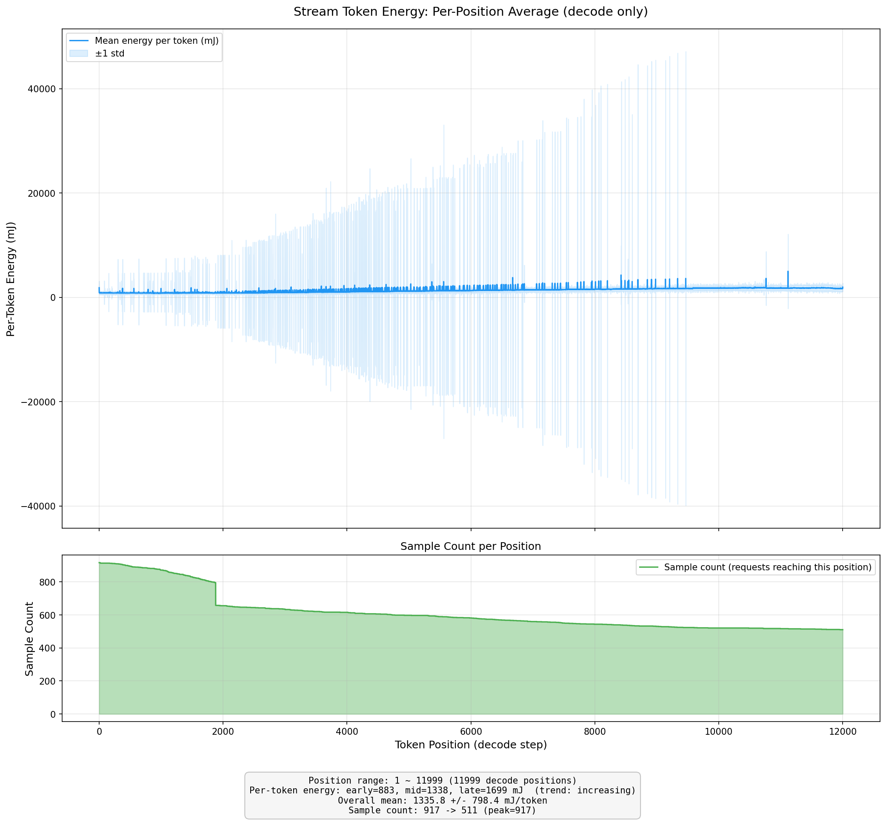

| 区间 | 平均能耗 (mJ/token) | 样本数 (count) | 相对 pos 500 |
|------|---------------------|----------------|-------------|
| pos 1~100 | 868.5 | 915 | — |
| pos 100~500 | 851.2 | 908 | — |
| pos 500~1000 | 849.7 | 885 | **基准** |
| pos 1000~2000 | 857.3 | 814 | +0.9% |
| pos 2000~3000 | 911.1 | 645 | +7.2% |
| pos 3000~4000 | 1,029.7 | 622 | +21.2% |
| pos 5000~6000 | 1,299.3 | 591 | **+52.9%** |
| pos 8000~9000 | 1,629.5 | 538 | **+91.8%** |
| pos 10000~11000 | 1,810.1 | 520 | **+113.0%** |

**线性拟合** (pos 500 ~ 11,500):

$$E_{\text{decode}}(p) = 0.1065 \times p + 698.7 \quad \text{(mJ/token)}$$

- **斜率**: 106.5 mJ / 1000 positions
- **R² = 0.8325**
- 在 pos 11,000 处，能耗比 pos 500 增长 **148.7%**

#### 3.1.3 能耗分布

> 📊 **图 2**: Per-token Energy Distribution (Qwen3-8B, Stream)
>
> 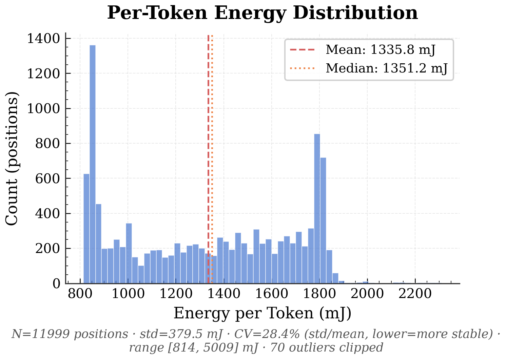

#### 3.1.4 累积能耗

> 📊 **图 3**: Cumulative Decode Energy (Qwen3-8B, Stream)
>
> 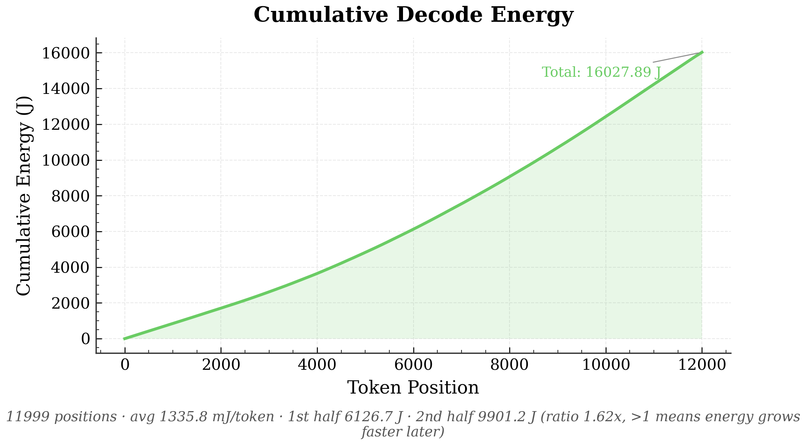

#### 3.1.5 并发度分析

> 📊 **图 4**: Per-token Energy vs. Sample Count (Qwen3-8B, Stream)
>
> 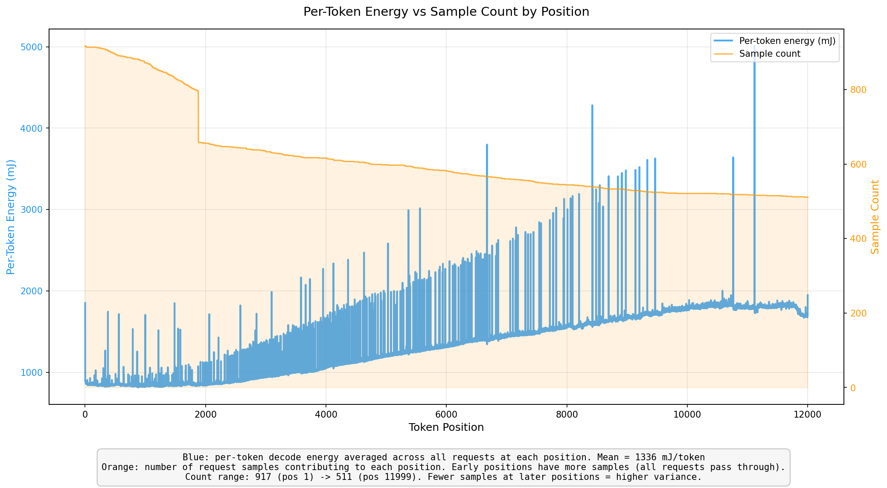

**关于 count 列的说明**：

CSV 中的 `count` **不是某一时刻的并发度**，而是**有多少个不同的请求曾经经过该 position 并贡献了一个能耗样本**。例如 count=917 at position 1 表示有 917 个请求经过了 position 1，但这 917 次发生在不同时刻。

- pos 1: count = 917 (几乎所有请求都生成了至少 1 个 decode token)
- pos 5000: count ≈ 591 (部分请求提前结束)
- pos 11999: count = 511 (只有长文本请求到达)
- 稳定度: min/max = 511/917 = 55.7%

由于使用了 `--warmup 50` 和 `--req_rate 20`，实验期间的并发度保持相对稳定，能耗增长趋势主要反映 KV cache 效应而非并发度变化。

---

### 3.2 实验 B: 并发批量场景 (Qwen3-32B)

#### 3.2.1 总体统计

| 指标 | 值 |
|------|-----|
| 并发请求 | 30 |
| 重复轮次 | 3 |
| 总生成 tokens | 574,606 (3 轮合计) |
| 平均吞吐量 | 161.4 tok/s |
| 最大 position | 14,998 |
| Prefill 平均能耗 | 23,224 mJ/请求 |

**每轮统计**:

| 轮次 | Seed | 生成 Tokens | 吞吐量 (tok/s) | Decode 均值 (mJ/token) | Prefill 总能耗 (mJ) |
|------|------|-------------|----------------|----------------------|-------------------|
| 1 | 321 | 199,948 | 166.8 | 6,866.5 | 782,051 |
| 2 | 322 | 192,830 | 162.9 | 6,871.5 | 711,276 |
| 3 | 323 | 181,828 | 154.6 | 7,620.7 | 596,855 |

#### 3.2.2 Active 请求数衰减

由于部分请求提前生成 EOS token，batch 中的 active 请求数随 position 递减：

| Position | Active 请求数 | 衰减比例 |
|----------|-------------|---------|
| 0 | 30 | 100% |
| 1,000 | 23 | 76.7% |
| 5,000 | 13 | 43.3% |
| 10,000 | 11 | 36.7% |
| 14,000 | 10 | 33.3% |

> 在 batch 模式中，active 请求数的衰减不影响 per-token 能耗的准确性，因为 `per_token_energy = step_energy / active_requests` 已经做了归一化。

#### 3.2.3 能耗随 Position 的变化

> 📊 **图 5**: Per-token Decode Energy vs. Position (Qwen3-32B, Batch)
>
> 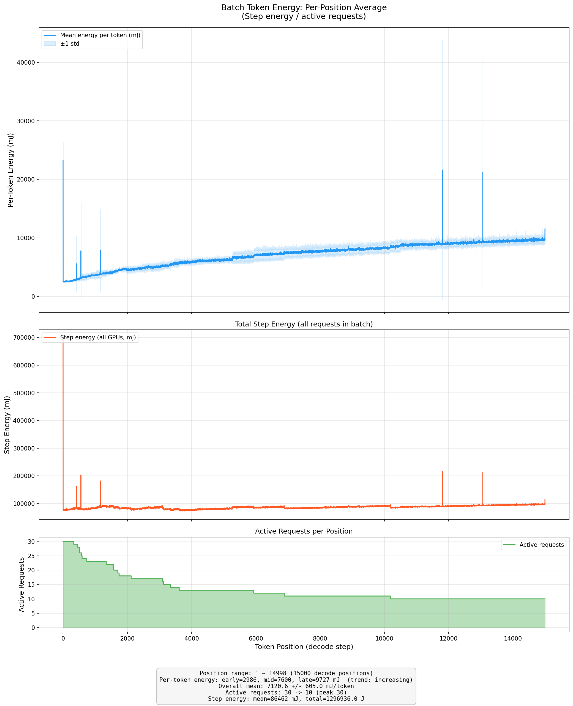

| 区间 | 平均能耗 (mJ/token) | Active 请求数 | Step 能耗 (mJ) | 相对 pos 500 |
|------|---------------------|-------------|--------------|-------------|
| pos 0~100 | 2,555 | 30.0 | 76,653 | — |
| pos 500~1000 | 3,400 | 23.9 | 80,946 | **基准** |
| pos 1000~2000 | 4,162 | 20.9 | 86,486 | +22.4% |
| pos 2000~3000 | 4,829 | 17.1 | 82,636 | +42.0% |
| pos 3000~5000 | 5,824 | 13.6 | 78,851 | +71.3% |
| pos 5000~7000 | 6,913 | 12.4 | 85,596 | +103.3% |
| pos 7000~10000 | 7,863 | 11.0 | 86,492 | +131.2% |
| pos 10000~12000 | 8,780 | 10.1 | 88,574 | +158.2% |
| pos 12000~15000 | 9,376 | 10.0 | 93,760 | **+175.7%** |

**线性拟合** (pos 500 ~ 14,500):

$$E_{\text{decode}}(p) = 0.4331 \times p + 3939.5 \quad \text{(mJ/token)}$$

- **斜率**: 433.1 mJ / 1000 positions
- **R² = 0.9530**
- 在 pos 14,000 处，能耗比 pos 500 增长 **140.7%**

#### 3.2.4 Step 能耗 vs Per-token 能耗

> 📊 **图 6**: Step Energy vs. Per-token Energy (Qwen3-32B, Batch)
>
> 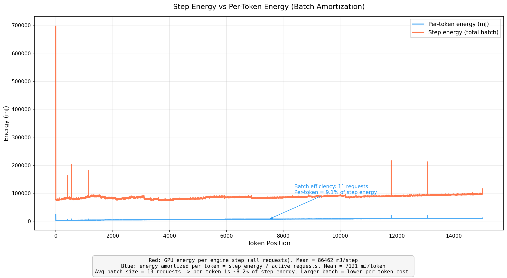

**关键观察**: Step 总能耗 (76,000 ~ 94,000 mJ) 变化幅度远小于 per-token 能耗 (2,500 ~ 9,400 mJ) 的变化。这是因为：
- Step 总能耗 = active_requests × per_token_energy
- 当 active 请求数从 30 减少到 10 时，即使 per_token_energy 增长了 175%，step 总能耗仅增长约 23%

#### 3.2.5 累积能耗与分布

> 📊 **图 7**: Cumulative Decode Energy (Qwen3-32B, Batch)
>
> 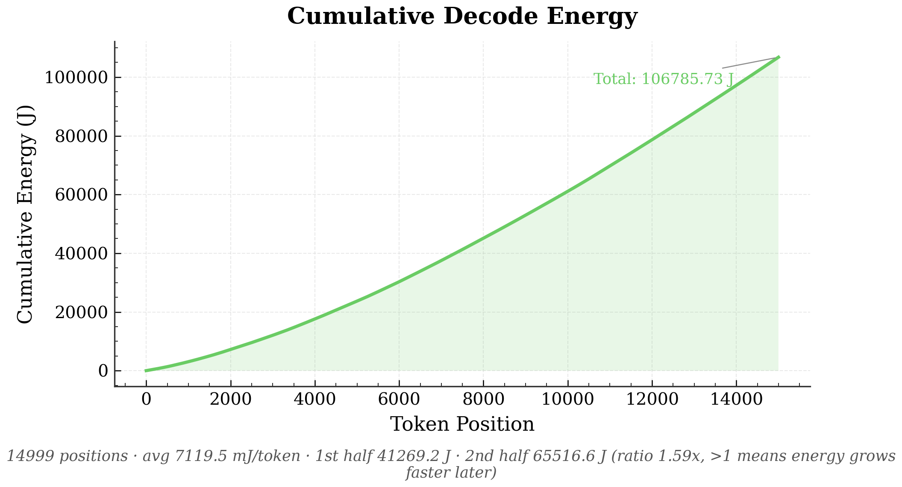

> 📊 **图 8**: Per-token Energy Distribution (Qwen3-32B, Batch)
>
> 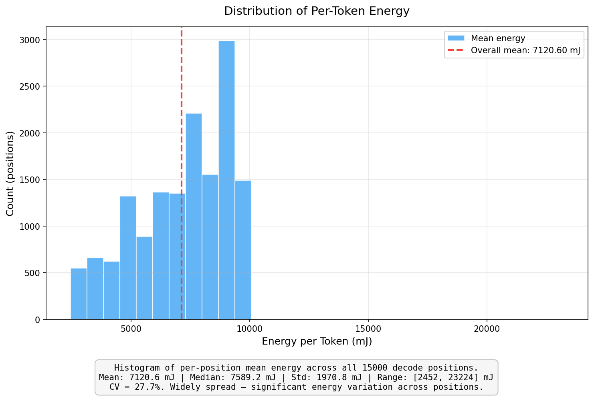

---

### 3.3 实验 C: Batch Size Sweep (Qwen3-8B, max_num_seqs=40/60/100)

#### 3.3.1 实验设计

实验 C 是本次新增的关键实验，旨在回答：**在相同模型、相同请求负载下，不同的 batch size 上限对能耗和吞吐量有什么影响？**

通过 vLLM 的 `max_num_seqs` 参数，直接控制每个 step 中同时处理的最大请求数。三轮实验依次使用 max_num_seqs = 40, 60, 100，每轮在**独立子进程**中重新初始化 vLLM 引擎（避免 CUDA 上下文残留导致的 spawn 死锁问题）。

#### 3.3.2 总体对比

| 指标 | mns=40 | mns=60 | mns=100 |
|------|--------|--------|---------|
| 总注入请求 | 920 | 920 | 920 |
| 总生成 tokens | 893,241 | 1,049,313 | 1,247,337 |
| 吞吐量 (tok/s) | 496.1 | 582.8 | 692.8 |
| Decode 均值 (mJ/token) | **1,681.2** | **1,483.5** | **1,096.7** |
| 最大 position | 11,999 | 11,999 | 11,999 |
| 总 steps | 22,548 | 18,033 | 13,770 |
| Wall time | 1,800.4s | 1,800.4s | 1,800.4s |
| 平均 GPU 功率 (8卡) | 821 W | 819 W | 746 W |
| 能效 (tokens/Joule) | 0.59 | 0.67 | **0.91** |

**关键发现**：

- **吞吐量随 batch size 线性增长**: mns=100 的吞吐量是 mns=40 的 **1.40×**
- **Per-token 能耗随 batch size 显著下降**: mns=100 仅为 mns=40 的 **65.2%**，节省 **34.8%** 能耗
- **能效 (tokens/Joule) 提升 54%**: 从 0.59 (mns=40) 提升到 0.91 (mns=100)
- **总 GPU 功率几乎不变**: 821W vs 746W，仅差 9%

#### 3.3.3 能耗随 Position 的变化 (三组对比)

> 📊 **图 9**: Per-token Decode Energy vs. Position (Qwen3-8B, mns=40)
>
> 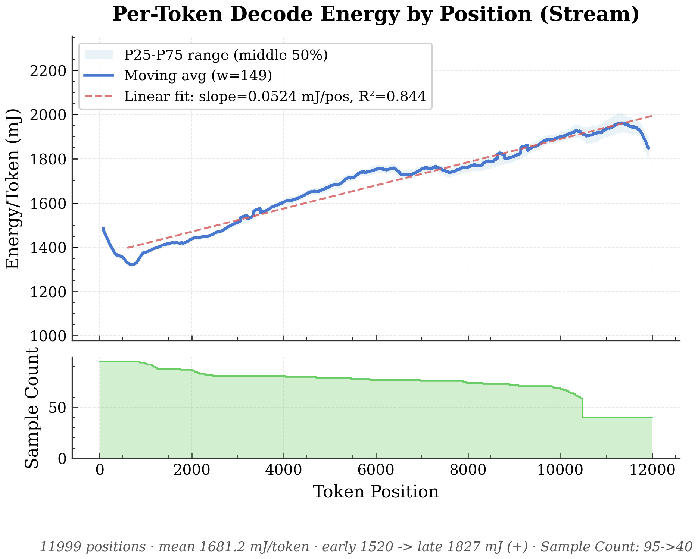

> 📊 **图 10**: Per-token Decode Energy vs. Position (Qwen3-8B, mns=60)
>
> 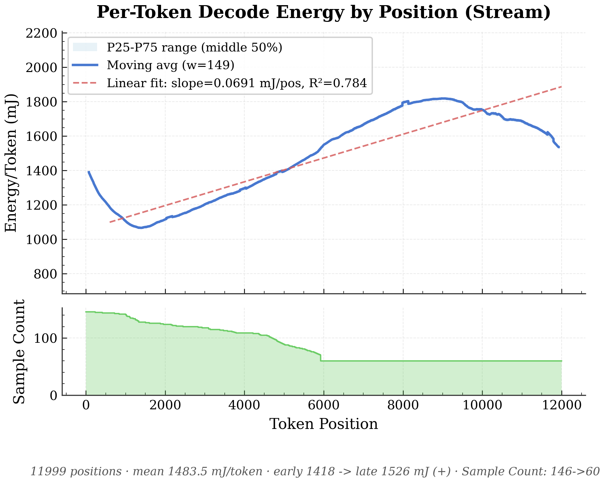

> 📊 **图 11**: Per-token Decode Energy vs. Position (Qwen3-8B, mns=100)
>
> 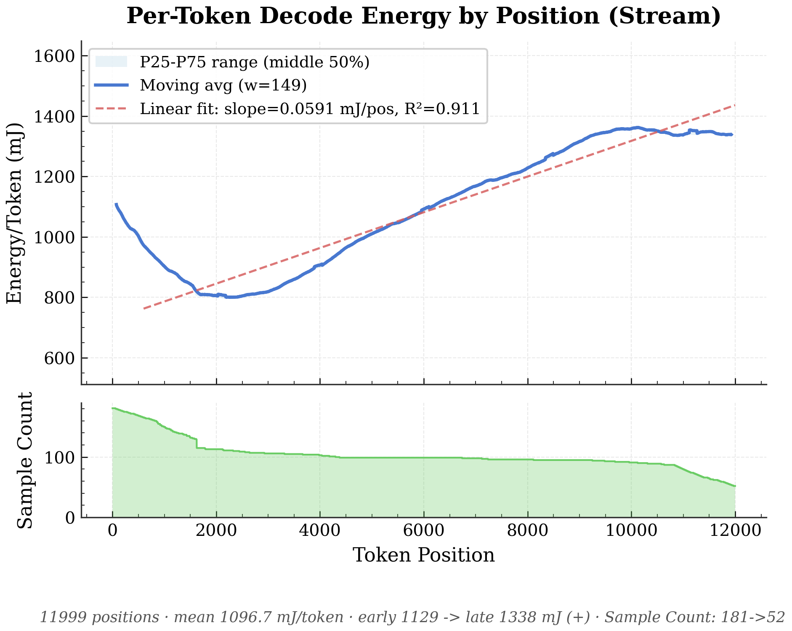

**三组 per-position 能耗详细对比**:

| 区间 | mns=40 (mJ) | mns=60 (mJ) | mns=100 (mJ) | 100/40 比值 |
|------|------------|------------|-------------|------------|
| pos 1~100 | 1,496.5 | 1,403.6 | 1,115.0 | 0.75× |
| pos 500~1000 | 1,341.7 | 1,157.1 | 946.8 | **0.71×** |
| pos 2000~3000 | 1,468.6 | 1,156.7 | 807.6 | **0.55×** |
| pos 5000~6000 | 1,716.9 | 1,463.9 | 1,048.2 | 0.61× |
| pos 8000~9000 | 1,791.4 | 1,806.3 | 1,272.0 | 0.71× |
| pos 10000~11000 | 1,915.1 | 1,713.7 | 1,349.6 | 0.70× |

> **核心观察**: 在所有 position 区间，mns=100 的 per-token 能耗都显著低于 mns=40。在 pos 2000~3000 区间，mns=100 仅为 mns=40 的 **55%**，节能效果最为显著。

#### 3.3.4 线性拟合对比

三组实验的线性拟合结果 (pos 500 ~ 11,500):

| 指标 | mns=40 | mns=60 | mns=100 |
|------|--------|--------|---------|
| 斜率 k (mJ/pos) | 0.0546 | 0.0760 | 0.0601 |
| 截距 E₀ (mJ) | 1,355.6 | 1,031.0 | 726.8 |
| R² | 0.8533 | 0.8538 | **0.9024** |
| E(500) (mJ) | 1,382.9 | 1,069.0 | 756.9 |
| E(11000) (mJ) | 1,955.9 | 1,866.8 | 1,387.7 |
| 增长率 (500→11000) | 41.4% | 74.6% | **83.4%** |

$$E_{\text{mns=40}}(p) = 0.0546p + 1355.6 \quad (R^2 = 0.85)$$

$$E_{\text{mns=60}}(p) = 0.0760p + 1031.0 \quad (R^2 = 0.85)$$

$$E_{\text{mns=100}}(p) = 0.0601p + 726.8 \quad (R^2 = 0.90)$$

**分析**:

1. **截距 E₀ 随 batch size 大幅下降**: 从 1,355.6 (mns=40) 降至 726.8 (mns=100)，下降 **46.4%**。截距代表模型权重读取的固定能耗在请求间的分摊——batch size 越大，固定开销被更多请求分摊
2. **斜率 k 相对稳定**: 三组的斜率在 54.6~76.0 mJ/1000pos 范围内，没有随 batch size 显著变化。这符合预期：KV cache 的增量是 per-request 的，不受 batch size 影响
3. **R² 在 mns=100 时最高 (0.90)**: 更大的 batch size 意味着更稳定的 GPU 利用率，减少了能耗波动

#### 3.3.5 Step 级别能耗分析

通过分析每个 step 的能耗和 active 请求数，可以揭示 batch size 对 GPU 效率的微观影响：

**满载 (active == max_num_seqs) 时的 step 能耗**:

| 指标 | mns=40 | mns=60 | mns=100 |
|------|--------|--------|---------|
| 满载 steps 数 | 21,827 (96.9%) | 16,570 (91.9%) | 10,833 (78.7%) |
| Step 能耗 (mJ) | 66,379 ± 11,077 | 84,677 ± 19,327 | 109,624 ± 26,245 |
| Per-token 能耗 (mJ) | 1,659.5 ± 276.9 | 1,411.3 ± 322.1 | 1,096.2 ± 262.4 |

> 📊 **图 12**: Per-token Energy Distribution (Qwen3-8B, mns=40)
>
> 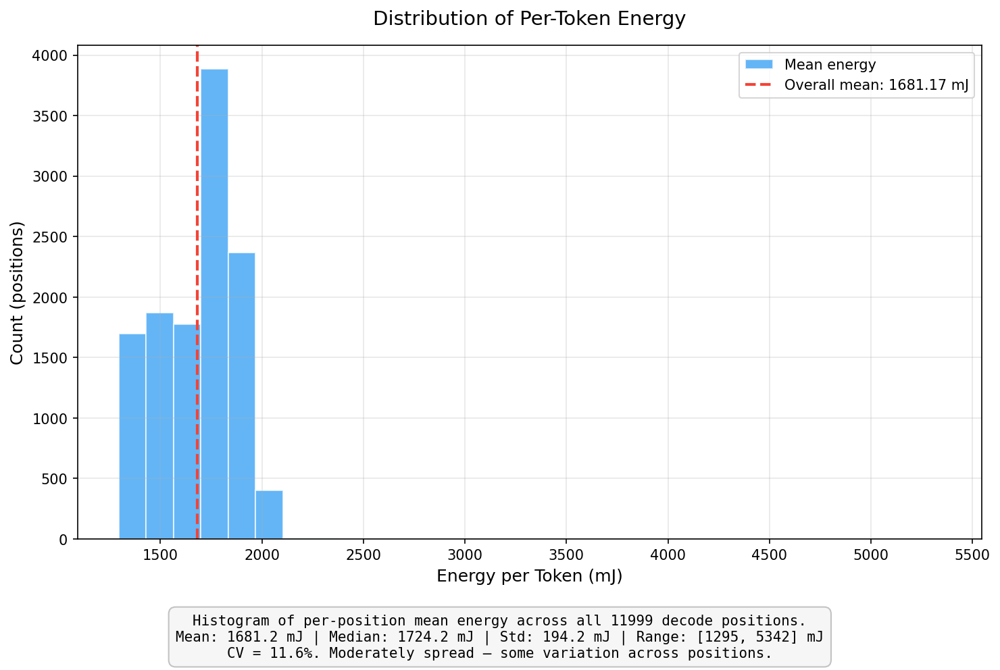

> 📊 **图 13**: Per-token Energy Distribution (Qwen3-8B, mns=60)
>
> 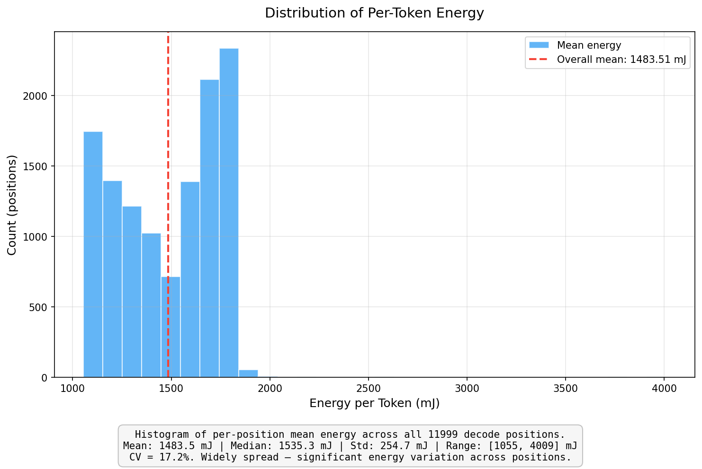

> 📊 **图 14**: Per-token Energy Distribution (Qwen3-8B, mns=100)
>
> 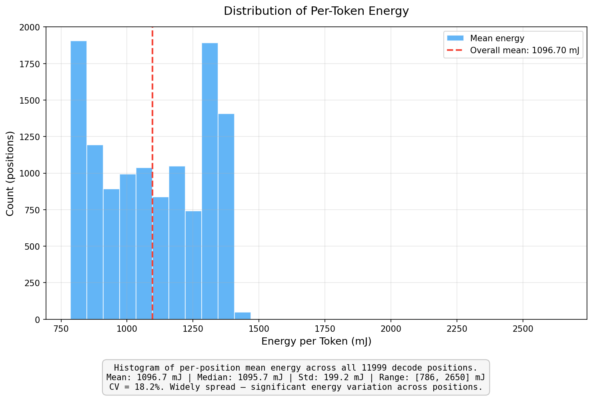

#### 3.3.6 不同并发度下的 Per-token 能耗 (跨配置对比)

一个极具洞察力的分析是：**在不同 max_num_seqs 配置下，当实际 active 请求数相同时，per-token 能耗是否一致？**

**active=40 时的 per-token 能耗**:

| 配置 | Steps 数 | Step 能耗 (mJ) | Per-token 能耗 (mJ) |
|------|---------|---------------|-------------------|
| mns=40 (满载) | 21,827 | 66,379 | **1,659.5** |
| mns=60 (部分) | 32 | 49,676 | **1,241.9** |
| mns=100 (部分) | 35 | 44,728 | **1,118.2** |

> **重要发现**: 即使实际 active 请求数都是 40，mns=100 配置下的 per-token 能耗 (1,118 mJ) 比 mns=40 配置 (1,660 mJ) **低 32.6%**！

这一差异的原因是：在 mns=40 配置中，active=40 对应的是**满载稳态**，此时请求处于各种不同的 position（有的在 pos 100，有的在 pos 8000），**KV cache 大小的分布范围很广**。而在 mns=100 配置中，active=40 只发生在**请求尚未填满 batch 的早期阶段**（warmup 刚注入 40 个请求时），此时所有请求的 position 都较低，KV cache 较小。

这证实了一个关键结论：**per-token 能耗不仅取决于当前 batch 中的请求数，还取决于这些请求的 KV cache 大小分布。**

#### 3.3.7 累积能耗对比

> 📊 **图 15**: Cumulative Decode Energy (Qwen3-8B, mns=40)
>
> 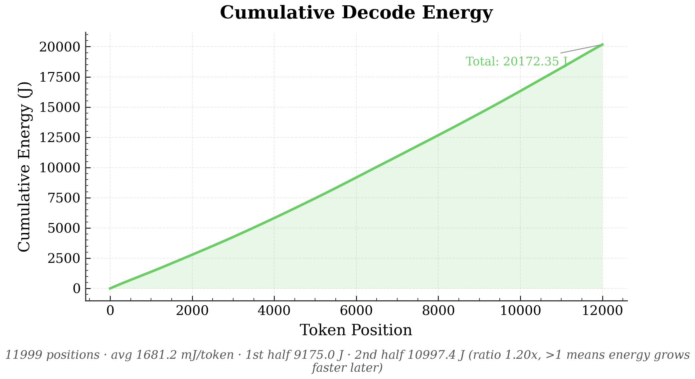

> 📊 **图 16**: Cumulative Decode Energy (Qwen3-8B, mns=60)
>
> 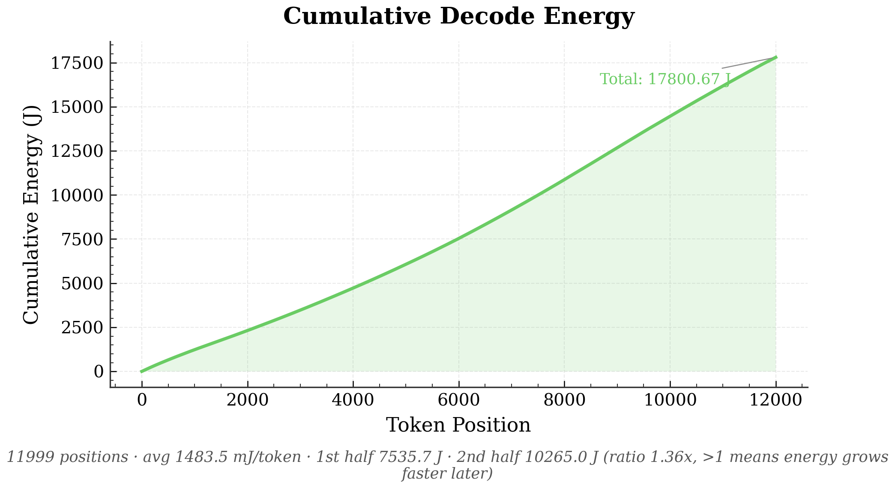

> 📊 **图 17**: Cumulative Decode Energy (Qwen3-8B, mns=100)
>
> 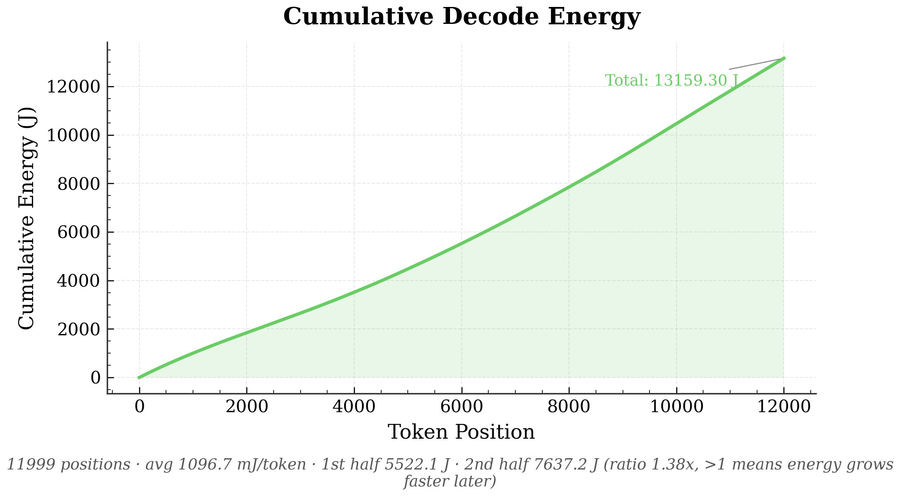

---

### 3.4 跨模型对比分析

#### 3.4.1 相同 Position 的能耗对比

| Position | Qwen3-8B (mJ) | Qwen3-32B (mJ) | 32B/8B 比值 |
|----------|---------------|-----------------|-------------|
| 500 | 854 | 3,026 | 3.54× |
| 1,000 | 824 | 3,522 | 4.27× |
| 2,000 | 841 | 4,604 | 5.48× |
| 5,000 | 1,207 | 6,195 | 5.13× |
| 8,000 | 1,588 | 7,850 | 4.94× |
| 11,000 | 1,792 | 9,010 | 5.03× |

> 32B/8B 的能耗比值约为 **3.5× ~ 5.5×**，与模型参数量比值 (32.5B/8.2B = **3.96×**) 基本吻合。

#### 3.4.2 能耗增长斜率对比

| 指标 | Qwen3-8B (Stream A) | Qwen3-32B (Batch B) | 比值 |
|------|---------------------|---------------------|------|
| 斜率 (mJ/1000 pos) | 106.5 | 433.1 | **4.07×** |
| 基线能耗 (mJ, 拟合截距) | 698.7 | 3,939.5 | 5.64× |
| 相对增长率 (/1000 pos) | 15.2% | 11.0% | 0.72× |
| R² | 0.8325 | 0.9530 | — |

**核心发现**：

1. **绝对斜率比值 (4.07×)** 接近模型参数量比值 (3.96×)，说明能耗增长的绝对量与模型规模成正比
2. **相对增长率**: 8B 模型的相对增长率 (15.2%/1000 pos) 反而**高于** 32B (11.0%/1000 pos)，因为 8B 的基线能耗更低，KV cache 增长的相对影响更大
3. **R² 差异**: Batch 模式 (0.95) 比 Stream 模式 (0.83) 更高，因为 batch 中 position 完全对齐，消除了并发度波动的噪声

---

### 3.5 跨 Batch Size 对比分析

#### 3.5.1 能耗-吞吐量权衡

将实验 C 的三组数据与实验 A 放在一起，可以清晰看到 batch size 对系统效率的影响：

| 配置 | Batch Size | 吞吐量 (tok/s) | Per-token E (mJ) | 能效 (tok/J) | 相对 mns=40 吞吐 | 相对 mns=40 能耗 |
|------|-----------|----------------|-----------------|-------------|-----------------|-----------------|
| 实验 C (mns=40) | 40 | 496.1 | 1,681.2 | 0.59 | 1.00× | 1.00× |
| 实验 C (mns=60) | 60 | 582.8 | 1,483.5 | 0.67 | 1.17× | 0.88× |
| 实验 C (mns=100) | 100 | 692.8 | 1,096.7 | 0.91 | 1.40× | 0.65× |
| 实验 A (不限) | ~不限 | 615.9 | 849.7* | — | 1.24× | — |

\* 实验 A 的 per-token 能耗取 pos 500~1000 区间的均值，因为实验 A 的请求注入率和时长不同，整体均值不直接可比。

#### 3.5.2 Batch Size 对固定开销分摊的影响

从线性拟合的截距 E₀ 可以看到固定开销的分摊效果：

$$\text{分摊效率} = \frac{E_0(\text{mns=40})}{E_0(\text{mns=}N)}$$

| Batch Size | E₀ (mJ) | 分摊效率 | 理论分摊 (40/N) |
|-----------|---------|---------|----------------|
| 40 | 1,355.6 | 1.00× | 1.00× |
| 60 | 1,031.0 | 1.31× | 1.50× |
| 100 | 726.8 | **1.87×** | 2.50× |

> 实际分摊效率低于理论值 (1.87× vs 2.50×)，说明 batch size 增大带来的 step 能耗增加并非完全可忽略。但分摊效果依然非常显著。

#### 3.5.3 Batch Size 对 KV Cache 能耗斜率的影响

| Batch Size | 斜率 k (mJ/1000pos) | 解释 |
|-----------|---------------------|------|
| 40 | 54.6 | 基准 |
| 60 | 76.0 | +39.2% |
| 100 | 60.1 | +10.1% |

三组的斜率没有呈现清晰的单调趋势，而是在 54.6 ~ 76.0 mJ/1000pos 范围内波动。这符合理论预期：**KV cache 的增量能耗是 per-request 的**，每个请求的 KV cache 增长速率不受 batch size 影响。斜率的波动主要来自：

1. **并发度变化时的混叠效应**: 当有请求完成并被新请求替换时，新请求的 position 较低，拉低了该 step 的平均 per-token 能耗
2. **vLLM 调度器的 chunked prefill**: 新请求的 prefill 和 decode 可能在同一 step 中执行，影响能耗分配

#### 3.5.4 为什么更大的 Batch Size 更节能？

从 step 级别的数据可以看到核心机制：

```
mns=40:  Step 能耗 = 66,379 mJ,  per-token = 66,379/40  = 1,659 mJ
mns=60:  Step 能耗 = 84,677 mJ,  per-token = 84,677/60  = 1,411 mJ
mns=100: Step 能耗 = 109,624 mJ, per-token = 109,624/100 = 1,096 mJ
```

**Step 能耗的增长速度远低于 batch size 的增长速度**：

- mns 从 40 → 100 (2.5×)，Step 能耗从 66K → 110K (仅 **1.65×**)
- 因此 per-token 能耗下降了 **34.8%**

这一现象的物理解释是：

1. **模型权重读取是共享的**: 无论 batch 中有多少请求，每个 step 只需从 HBM 读取一次模型权重 (~1.91 GB/GPU for 8B)。这部分能耗被 batch 中所有请求分摊
2. **Attention 计算的 batch 效率**: GPU 的 Tensor Core 在处理更大的矩阵时效率更高 (更好的 SM 利用率)
3. **固定开销分摊**: step 调度、NCCL 通信、kernel launch 等固定开销被更多 token 分摊

---

## 4. 理论分析与验证

### 4.1 Decode 阶段的内存访问模型

每生成一个 token，GPU 需要从 HBM 读取：

1. **模型权重** (固定，与 position 无关):

$$M_{\text{weight}} = \frac{N_{\text{params}} \times B_{\text{dtype}}}{TP}$$

| 模型 | 参数量 | 每 GPU 权重读取量 |
|------|--------|------------------|
| Qwen3-8B | 8.2B | **1.91 GB** |
| Qwen3-32B | 32.5B | **7.57 GB** |

2. **KV cache** (线性增长):

$$M_{\text{KV}}(p) = 2 \times N_{\text{KV\_heads}} \times d_{\text{head}} \times B_{\text{dtype}} \times N_{\text{layers}} \times p \div TP$$

| 模型 | 每 token KV (per GPU) | pos 5000 KV (per GPU) | pos 11000 KV (per GPU) |
|------|----------------------|----------------------|----------------------|
| Qwen3-8B | 18.0 KB | 87.9 MB | 193.4 MB |
| Qwen3-32B | 32.0 KB | 156.2 MB | — |

3. **KV/Weight 比值**:

| 模型 | pos 500 | pos 2000 | pos 5000 | pos 11000 |
|------|---------|----------|----------|-----------|
| Qwen3-8B | 0.45% | 1.80% | 4.50% | **9.89%** |
| Qwen3-32B | 0.20% | 0.81% | 2.02% | 5.65% |

### 4.2 Batch Size 对内存访问的影响

在 batch decode 中，每个 step 的 HBM 读取量为：

$$M_{\text{step}}(B, p_1, ..., p_B) = M_{\text{weight}} + \sum_{i=1}^{B} M_{\text{KV}}(p_i)$$

Per-token 能耗为：

$$E_{\text{token}} = \frac{E_{\text{step}}}{B} \approx \frac{E_{\text{weight}}}{B} + \overline{E_{\text{KV}}}$$

其中 $E_{\text{weight}}/B$ 随 batch size 增大而线性下降，$\overline{E_{\text{KV}}}$ 是每个请求自身 KV cache 的平均能耗。

**理论预测 vs 实测**:

以 Qwen3-8B 为例，假设权重读取能耗约为截距的主要成分：

| 从 mns=40 到 mns=100 | 理论 | 实测 |
|---------------------|------|------|
| E₀ 下降比例 | 1 - 40/100 = **60%** | 1 - 726.8/1355.6 = **46.4%** |

实测下降幅度略小于理论值，原因是：
- 截距 E₀ 不完全等于权重读取能耗，还包含其他与 batch size 无关的开销
- 更大的 batch 意味着更多的 KV cache 总量需要读取，增加了 step 的内存带宽压力

### 4.3 为什么实测斜率远大于纯 HBM 能耗预测？

使用 HBM2 的理论能耗 (12.8 pJ/Byte) 计算 KV cache 增长带来的纯 HBM 能耗增量：

| 模型 | 预测 ΔE (mJ/1000 pos) | 实测 ΔE (mJ/1000 pos) | 比值 |
|------|----------------------|----------------------|------|
| Qwen3-8B | 1.89 | 106.5 (实验 A) | **56×** |
| Qwen3-32B | 3.36 | 433.1 | **129×** |

实测值远大于纯 HBM 能耗预测，原因如下：

1. **Attention 计算能耗**：KV cache 增长不仅增加内存读取，还增加 attention 的 FLOPs (Q·K^T 和 Attn·V 的矩阵乘法)。每增加 1000 个 KV position：
   - Qwen3-8B: +73.7 MFLOP/GPU
   - Qwen3-32B: +262.1 MFLOP/GPU

2. **GPU Package-level 能耗**：NVML 测量的是整个 GPU 封装的能耗，包括：
   - HBM DRAM 能耗 (12.8 pJ/Byte)
   - 片上互联和 NoC 能耗
   - L2 cache 和寄存器文件能耗
   - SM (Streaming Multiprocessor) 计算能耗
   - 电压调节器损耗

3. **执行时间延长的静态功耗**：KV cache 增长导致每个 step 的执行时间变长，在此期间 GPU 的静态功耗 (idle power) 也在消耗能量

### 4.4 模型规模与能耗斜率的关系

| 比较维度 | Qwen3-8B | Qwen3-32B | 比值 |
|---------|----------|-----------|------|
| 模型参数量 | 8.2B | 32.5B | 3.96× |
| 层数 | 36 | 64 | 1.78× |
| Q-heads/GPU | 4 | 8 | 2.00× |
| 层数 × Q-heads/GPU | 144 | 512 | **3.56×** |
| 实测能耗斜率 | 106.5 | 433.1 | **4.07×** |

能耗斜率的比值 (4.07×) 与 `层数 × Q-heads/GPU` 的比值 (3.56×) 接近，这符合理论预期：**attention 的计算量和 KV cache 读取量都与 (层数 × heads) 成正比**。

---

## 5. 核心结论

### 结论 1: Decode 阶段的 per-token 能耗随 KV cache 长度线性增长

三组实验一致表明，decode 阶段的 per-token GPU 能耗与已生成的 token 数量 (position) 呈**线性关系**：

$$E_{\text{token}}(p) = k \times p + E_0$$

其中 $k$ (斜率) 反映 KV cache 增长的边际能耗，$E_0$ (截距) 反映模型权重读取的固定能耗。

| 实验 | 模型 | Batch Size | k (mJ/pos) | E₀ (mJ) | R² |
|------|------|-----------|-----------|---------|-----|
| A (Stream) | Qwen3-8B | ~不限 | 0.1065 | 698.7 | 0.83 |
| B (Batch) | Qwen3-32B | 30 | 0.4331 | 3,939.5 | 0.95 |
| C (mns=40) | Qwen3-8B | 40 | 0.0546 | 1,355.6 | 0.85 |
| C (mns=60) | Qwen3-8B | 60 | 0.0760 | 1,031.0 | 0.85 |
| C (mns=100) | Qwen3-8B | 100 | 0.0601 | 726.8 | **0.90** |

### 结论 2: 能耗增长幅度显著

在实际的长序列生成中，KV cache 导致的能耗增长**不可忽视**：

- **Qwen3-8B (实验 A)**: 从 pos 500 到 pos 11,000，能耗增长 **148.7%** (852 → 1,870 mJ)
- **Qwen3-32B (实验 B)**: 从 pos 500 到 pos 14,000，能耗增长 **140.7%** (4,156 → 10,003 mJ)
- **Qwen3-8B mns=100 (实验 C)**: 从 pos 500 到 pos 11,000，能耗增长 **83.4%** (757 → 1,388 mJ)

### 结论 3: 能耗增长的绝对量与模型规模成正比

32B 模型的能耗斜率是 8B 模型的 **4.07 倍**，接近模型参数量的比值 (3.96×)。这意味着**模型越大，长序列生成的能耗惩罚越严重**。

### 结论 4: 相对增长率与模型规模负相关

8B 模型的相对增长率 (15.2%/1000 pos) **高于** 32B (11.0%/1000 pos)。这是因为小模型的基线能耗 (权重读取) 更低，KV cache 的相对占比更大。

### 结论 5: Batch 模式的 R² 显著高于 Stream 模式

| 模式 | R² | 原因 |
|------|-----|------|
| Batch (实验 B) | 0.9530 | Position 完全对齐，无并发度波动 |
| Stream (实验 A) | 0.8325 | 不同请求在同一 step 处于不同 position，并发度有波动 |
| Stream mns=100 (实验 C) | 0.9024 | 大 batch size 带来更稳定的 GPU 利用率 |

Batch 模式更适合精确测量能耗-position 关系；Stream 模式更接近真实场景。值得注意的是，**更大的 batch size 可以提高 stream 模式的 R²**。

### 结论 6: 更大的 Batch Size 显著降低 Per-token 能耗 ⭐ (新)

| 指标 | mns=40 → mns=100 变化 |
|------|---------------------|
| 吞吐量 | +39.6% (496 → 693 tok/s) |
| Per-token 能耗 | **-34.8%** (1,681 → 1,097 mJ) |
| 能效 (tok/J) | **+54.2%** (0.59 → 0.91) |
| 总 GPU 功率 | -9.1% (821 → 746 W) |

**核心机制**: 模型权重读取 (~1.91 GB/GPU) 是每个 step 的固定开销，batch size 越大，这部分开销被更多请求分摊。Step 总能耗增长 (1.65×) 远低于 batch size 增长 (2.5×)，导致 per-token 能耗大幅下降。

### 结论 7: Per-token 能耗同时取决于 Batch Size 和 KV Cache 分布 ⭐ (新)

即使 active 请求数相同 (如 active=40)，不同 max_num_seqs 配置下的 per-token 能耗也不同：

| 配置 | active=40 时 Per-token E (mJ) | 原因 |
|------|------------------------------|------|
| mns=40 (满载) | 1,659.5 | 请求处于各种 position，KV cache 大小分布广 |
| mns=100 (部分) | 1,118.2 | 仅在早期出现，所有请求 position 较低 |

这证明 **per-token 能耗是 batch size 和 KV cache 大小分布的函数**，不能简单地用 `step_energy / active_requests` 来建模。

---

## 6. 对未来工作的指导意义

### 6.1 能耗感知的推理调度

**发现**: 长序列的后期 token 能耗远高于前期。

**指导**:
- 在能耗受限的边缘设备 (如 UAV) 上，可以设置**动态 max_tokens 上限**：当预估的剩余能量不足以支撑后续高能耗 token 时，提前终止生成
- 能耗预算公式: $E_{\text{total}} = \sum_{p=0}^{L} (k \cdot p + E_0) = k \cdot \frac{L(L+1)}{2} + E_0 \cdot L$

### 6.2 Batch Size 优化策略 ⭐ (新)

**发现**: batch size 从 40 增加到 100，per-token 能耗下降 34.8%，吞吐量提升 39.6%。

**指导**:
- **尽可能使用更大的 batch size**: 在 GPU 显存允许的范围内，增大 `max_num_seqs` 可以同时提升吞吐量和能效
- **动态 batch size 调整**: 在请求负载较低时，可以适当等待积累更多请求再一起处理，以获得更好的 batch 效率
- **能耗-延迟权衡**: 更大的 batch size 虽然降低了 per-token 能耗，但可能增加单个请求的端到端延迟 (因为需要等待 batch 填满)。在实时性要求高的场景下需要平衡

**量化收益** (以 Qwen3-8B 为例):
- 每增加 1 个 batch size (从 40 开始)，per-token 能耗约下降 **9.7 mJ** (约 0.58%)
- 在 1800 秒实验中，mns=100 比 mns=40 多生成了 **354,096 个 token** (+39.6%)

### 6.3 KV Cache 压缩的能耗收益量化

**发现**: 能耗增长的根源是 KV cache 的线性膨胀。

**指导**:
- KV cache 压缩技术 (如 GQA、MQA、量化、eviction) 的能耗收益可以精确量化
- 例如，将 KV cache 压缩 50%，预期能耗斜率也减少约 50%
- 对于 Qwen3-32B，如果能将斜率从 433 mJ/1000pos 降至 216 mJ/1000pos，在 pos 14000 处可节省 **3,038 mJ/token**

### 6.4 投机解码 (Speculative Decoding) 的能耗优化

**发现**: 小模型的相对能耗增长率更高 (15.2% vs 11.0%)。

**指导**:
- 在 DSSD/DSD 架构中，draft 模型 (小模型) 生成 γ 个候选 token，target 模型 (大模型) 验证
- 如果 draft 模型在长序列上的能耗增长比例更大，那么投机解码在**长序列场景下的能耗优势会进一步放大**
- 可以设计**自适应 γ**: 在序列早期使用较大的 γ (能耗差距小)，在序列后期使用较小的 γ (能耗差距大，减少 draft 模型的浪费)

### 6.5 Batch Size 感知的 Speculative Decoding ⭐ (新)

**发现**: batch size 对 per-token 能耗有显著影响 (mns=100 比 mns=40 节省 35%)。

**指导**:
- 在 DSSD 架构中，draft 模型和 target 模型可能运行在不同的 batch size 下
- **draft 模型 (小模型)** 由于参数量小，权重读取的固定开销低，batch size 的分摊效应相对较弱
- **target 模型 (大模型)** 权重读取开销大，batch size 分摊效应更强
- 因此，**在大模型端尽可能增大 batch size** 的能耗收益更大
- 可以设计 **异步 batch 策略**: draft 模型快速生成多组候选，target 模型积累到足够大的 batch 后一次性验证

### 6.6 模型选型的能耗-性能权衡

**发现**: 32B 模型的 per-token 能耗是 8B 的 ~5×，但能力更强。

**指导**:
- 对于短序列 (< 1000 tokens)，32B 的能耗惩罚主要来自权重读取 (~5×)
- 对于长序列 (> 10000 tokens)，KV cache 的额外能耗使得总能耗比值进一步增大
- 在能耗受限场景下，应优先考虑使用小模型 + 更多 token，而非大模型 + 更少 token

### 6.7 硬件选型参考

**发现**: 实测能耗斜率远大于纯 HBM 理论值 (56× ~ 129×)。

**指导**:
- 纯 HBM 能耗只是 GPU 总能耗的一小部分，优化 HBM 带宽/能效 (如 HBM3/HBM3e) 对总能耗的改善有限
- 更有效的优化方向是减少**计算量** (attention FLOPs) 和**执行时间** (静态功耗)
- 新一代 GPU (如 H100/H200) 的更高 HBM 带宽可以缩短每个 step 的执行时间，从而减少静态功耗占比

### 6.8 实验方法论的贡献

本实验验证了三种互补的 token-level 能耗测量方法：

| 方法 | 适用场景 | 优势 | 局限 |
|------|---------|------|------|
| **Batch 模式** | 精确的能耗-position 关系 | R² 高，position 对齐 | 不反映真实服务场景 |
| **Stream 模式** | 真实服务场景模拟 | 贴近实际，含并发度效应 | R² 较低，需长时间运行 |
| **Batch Size Sweep** | batch size 对能耗的影响 | 控制变量，结果可比 | 需要多轮实验 |

**推荐**: 先用 Batch 模式获取精确的 $k$ 和 $E_0$，再用 Stream 模式验证在真实场景下的适用性，最后用 Batch Size Sweep 找到最优的 batch size 配置。

---

## 附录

### A. 实验目录

```
output/
├── token_energy_stream_Qwen3-8B_auto_n20_t12000_rate20_dur12000_w50_20260311_105903/
│   ├── config.txt
│   ├── token_energy_stream_per_position.csv   (11,999 positions)
│   ├── token_energy_stream_per_sample.csv     (4,022 requests)
│   ├── token_energy_stream_rounds.csv         (1 round)
│   └── figures/                               (4 plots)
│
├── token_energy_batch_Qwen3-32B_auto_n30_t15000_r3_20260312_014204/
│   ├── config.txt
│   ├── token_energy_batch_per_position.csv     (15,001 positions)
│   ├── token_energy_batch_per_sample.csv       (90 samples)
│   ├── token_energy_batch_step_raw.csv         (44,999 steps)
│   ├── token_energy_batch_rounds.csv           (3 rounds)
│   ├── token_energy_batch_prefill.csv          (3 rounds + avg)
│   └── figures/                                (4 plots)
│
└── token_energy_stream_Qwen3-8B_auto_n20_t12000_rate30_dur1800_mns40-60-100_20260312_034702/
    ├── config.txt
    ├── batch_size_sweep_summary.csv            (3 轮汇总)
    ├── mns_40/                                 (max_num_seqs=40)
    │   ├── _summary.json
    │   ├── token_energy_stream_per_position.csv (11,999 positions)
    │   ├── token_energy_stream_per_sample.csv   (920 requests)
    │   ├── token_energy_stream_steps.csv        (22,548 steps)
    │   ├── token_energy_stream_rounds.csv       (1 round)
    │   └── figures/                             (4 plots)
    ├── mns_60/                                 (max_num_seqs=60)
    │   └── ... (同上结构)
    └── mns_100/                                (max_num_seqs=100)
        └── ... (同上结构)
```

### B. 复现命令

```bash
# 实验 A: Stream (Qwen3-8B)
python scripts/uav_client.py \
    --draft_model_name ~/model_hub/Qwen3-8B \
    --device auto \
    --mode token_energy_stream \
    --req_rate 20 --duration 12000 --warmup 50 \
    --token_max_tokens 12000 --token_samples 20 --seed 321

# 实验 B: Batch (Qwen3-32B)
python scripts/uav_client.py \
    --draft_model_name ~/model_hub/Qwen3-32B \
    --device auto \
    --mode token_energy_batch \
    --token_samples 30 --token_max_tokens 15000 \
    --batch_repeats 3 --seed 321

# 实验 C: Batch Size Sweep (Qwen3-8B)
python scripts/uav_client.py \
    --draft_model_name ~/model_hub/Qwen3-8B \
    --device auto \
    --mode token_energy_stream \
    --req_rate 30 --duration 1800 --warmup 30 \
    --token_max_tokens 12000 --token_samples 20 --seed 321 \
    --stream_batch_sizes "40,60,100"
```
